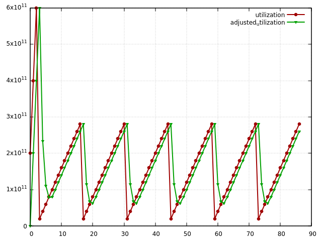

# rentbw modeling tool

mkdir build

cd build

cmake -DBUILD_TESTS=true ..

make -j

from the project folder execute:

sh run_and_plot.sh model.json out.csv

where model.json is a rentbw configuration file, out.csv - output csv file